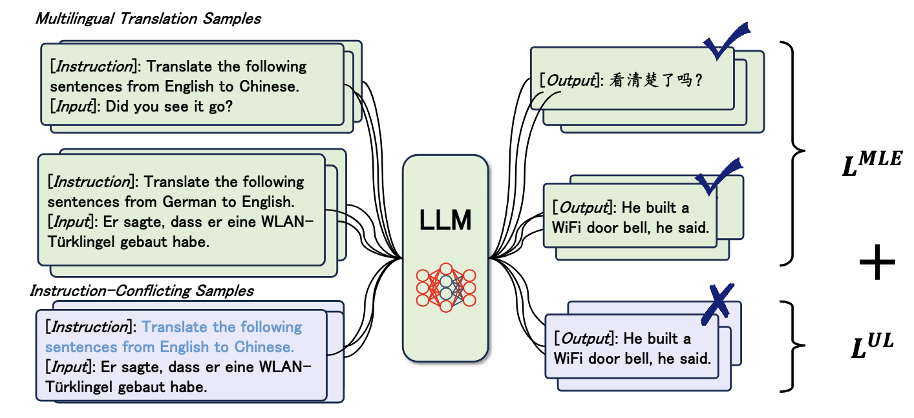
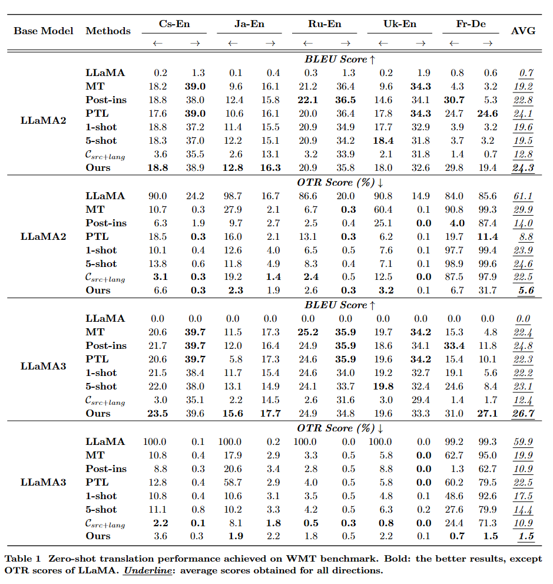
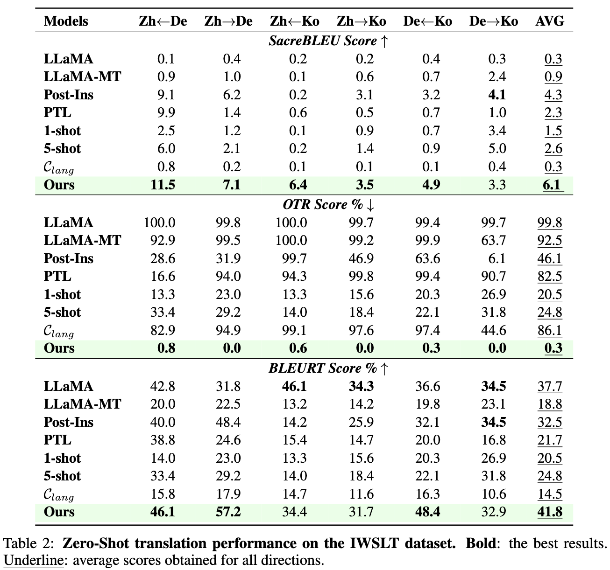

# Building Accurate Translation-Tailored LLMs with Language Aware Instruction Tuning

This repository is the official implementation of Building Accurate Translation-Tailored LLMs with Language Aware Instruction Tuning. ([preprint paper](https://arxiv.org/pdf/2403.14399.pdf) | [Media Coverage](https://slator.com/how-to-overcome-the-off-target-translation-issue-in-large-language-models/))

> Large language models (LLMs) exhibit remarkable capabilities in various natural language processing tasks, such as machine translation. However, the large number of parameters of LLMs incurs significant costs during inference. Previous works have attempted to train translation-tailored LLMs with moderately size models by fine-tuning them on translation data. Nevertheless, when applying zero-shot translation directions not included in the fine-tuning data, the issue of ignoring instructions and thus translating into the wrong language, i.e., the off-target translation issue, remains unsolved. In this work, we design a two-stage fine-tuning algorithm to improve the instruction-following ability of translation-tailored LLMs, particularly for maintaining accurate translation directions. We first fine-tune LLMs on the translation dataset to elicit basic translation capabilities. In the second stage, we construct instruction-conflicting samples by randomly replacing the instructions with incorrect ones. Then, we introduce an extra unlikelihood loss to reduce the probability assigned to those samples. Experiments on IWSLT and WMT benchmarks using the LLaMA2 and LLaMA3 models, spanning 16 zero-shot directions, demonstrate that, compared to the competitive baseline -- translation-finetuned LLaMA, our method could effectively reduce the off-target translation ratio (up to -62.4%), thus improving translation quality (up to +9.7 BLEU).  Analysis shows that our method could preserve the model's performance of other tasks, such as supervised translation and general tasks.

## Method

We introduce a two-stage fine-tuning algorithm for LLMs that leverages instruction-conflicting samples: 
>1) Pre-Tuning on Multilingual Translation Samples
>2) Unlikelihood Training with Instruction-Conflicting Samples

<div align="center">
    
</div>

## Requirements
Our code is based on HuggingFace's Transformer toolkit.
The version of Python is 3.10. 

```setup
bash setup.sh 
```

## Datasets
The datasets used in our paper are publicly available. 

* IWSLT: We take IWSLT17 data from [MMCR4NLP](https://arxiv.org/abs/1710.01025) for evaluation. 
* WMT:  We use the development sets from WMT2017 to WMT2020 for instruction tuning and the test sets of WMT22 for evaluation. The data can be downloaded from [WMT website](https://www.statmt.org/). 
* Alpaca: We use the officially released [Alpaca](https://github.com/tatsu-lab/stanford_alpaca) dataset. 

All translation training data from *{src_lang}* to *{tgt_lang}* are in the same template:
```
Below is an instruction that describes a task, paired with an input that provides further context. Write a response that appropriately completes the request.

### Instruction:
Translate the following sentences from {src_lang} to {tgt_lang}.

### Input:
{input}

### Response:
```

## Training

To train the model(s) in our paper, run this command:

```train
task_name=llama3-8b.mt12000
bash fine_tuning.sh ${task_name}
```
Note
* The path of pretrained LLMs, dataset, and checkpoint save path should be defined in the fine_tuning.sh file. 

* The default setting needs 8*GPUs. It can alternately use fewer GPUs with larger gradient_accumulation_steps, for example, GPUs number 4 and gradient_accumulation_steps 32.
  
## Evaluation

To evaluate models and reproduce the results in our paper, run the following commands.

1. MT: inference with the default template. 
```
cd evaluate
bash inference.sh ${task_name}
```
2. PTL: inference with the prompt in the target language. 
```
dataset=iwslt4
bash inference.sh ${task_name} ${dataset} False PTL
```
3. n-shot: inference with in-context learning. We consider the 1-shot and 5-shot settings. 
```
n_shot=1
# n_shot=5
bash inference.sh ${task_name} False False few_shot 1
```
4. #post_ins#: inference with post instruction template. This uses the model trained with a post instruction template. 
```
task_name=llama3-8b.mt12000.post_ins
bash inference.sh ${task_name} iwslt4 post_ins
```

We provide the record_result.py to collect the BLEU and OTR scores. 
```
python record_result.py 
```

Note
* The paths for checkpoints and test data should be defined.

* we use the follow prompt for llm-as-evaluator to compute the *win* rate % on [AlpacaEval](https://github.com/tatsu-lab/alpaca_eval) dataset,
To compute the *tie* ratio, we switch the positon of *model_1* and *model_2* and conduct evaluation twice. A scenario where each model wins one and loses one is considered a *tie*.

```
Prompt = 'I want you to create a leaderboard of different of large-language models. To do so, I will give you the instructions (prompts) given to the models, and the responses of two models. Please rank the models based on which responses would be preferred by humans. All inputs and outputs should be python dictionaries.\n\nHere is the prompt:\n{{\n    "instruction": """{instruction}""",\n}}\n\nHere are the outputs of the models:\n[\n    {{\n        "model": "model_1",\n        "answer": """{output_1}"""\n    }},\n    {{\n        "model": "model_2",\n        "answer": """{output_2}"""\n    }}\n]\n\nNow please rank the models by the quality of their answers, so that the model with rank 1 has the best output. Then return a list of the model names and ranks, i.e., produce the following output:\n[\n    {{"model": <model-name>, "rank": <model-rank>}},\n    {{"model": <model-name>, "rank": <model-rank>}}\n]\n\nYour response must be a valid Python dictionary and should contain nothing else because we will directly execute it in Python. Please provide the ranking that the majority of humans would give.\n'
```

## Results

The zero-shot translation performance comparison of our model and other baselines on WMT and IWSLT datasets:

  WMT dataset
<div align="center">
    
</div>

  IWSLT dataset
<div align="center">
    
</div>

## Media Coverage
- Slator: [How to Overcome the Off-Target Translation Issue in Large Language Models](https://slator.com/how-to-overcome-the-off-target-translation-issue-in-large-language-models/)

## Citation
If our method and code help you, please considering cite our work:
```
@inproceedings{Zan2024LAT,
  title={Building Accurate Translation-Tailored LLMs with Language Aware Instruction Tuning},
  author={Zan, Changtong and Ding, Liang and Shen, Li and Zhan, Yibing and Liu, Weifeng and Tao, Dacheng},
  booktitle={arXiv preprint},
  year={2024}
}
```
