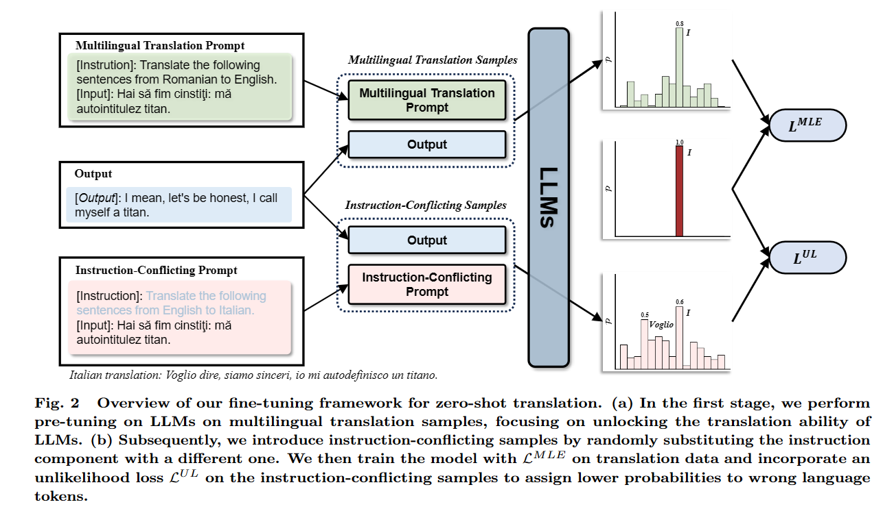
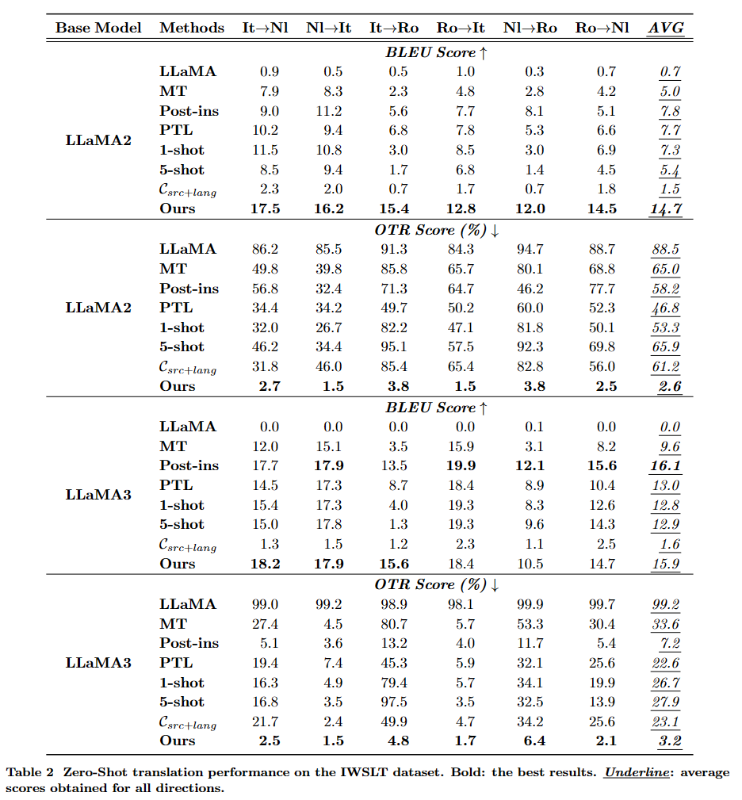

# LanguageAware_Tuning
Building Accurate Translation-Tailored LLMs with Language-Aware Instruction Tuning. ([preprint paper](https://arxiv.org/pdf/2403.14399.pdf) | [Media Coverage](https://slator.com/how-to-overcome-the-off-target-translation-issue-in-large-language-models/))

## Abstract

Translation-tailored Large language models (LLMs) exhibit remarkable translation capabilities, even competing with supervised-trained commercial translation systems. However, off-target translation remains an unsolved problem, especially for low-resource languages, hindering us from developing accurate LLMs-based translation models. To mitigate the off-target translation problem and enhance the performance of LLMs on translation, recent works have either designed advanced prompting strategies to highlight the functionality of translation instructions or exploited the in-context learning ability of LLMs by feeding few-shot demonstrations. However, these methods essentially do not improve LLM's ability to follow translation instructions, especially the language direction information. In this work, we design a two-stage fine-tuning algorithm to improve the instruction-following ability (especially the translation direction) of LLMs. Specifically, we first tune LLMs with the maximum likelihood estimation loss on the translation dataset to elicit the basic translation capabilities. In the second stage, we construct instruction-conflicting samples by randomly replacing the translation directions with a wrong one within the instruction, and then introduce an extra unlikelihood loss to learn those samples. Experiments on IWSLT and WMT benchmarks upon the LLaMA model spanning 16 zero-shot directions show that, compared to the competitive baseline -- translation-finetuned LLama, our method could effectively reduce the off-target translation ratio (averagely -53.3\%), thus improving translation quality with average +5.7 SacreBLEU and +16.4 BLEURT. Analysis shows that our method could preserve the model's general task performance on AlpacaEval.

## Method

We introduce a two-stage fine-tuning algorithm for LLMs that leverages instruction-conflicting samples: 
>1) Pre-Tuning on Multilingual Translation Samples
>2) Unlikelihood Training with Instruction-Conflicting Samples

<div align="center">
    
</div>

## Main Results

The zero-shot translation performance comparison of our model and other baselines on WMT and IWSLT datasets:

    WMT dataset
<div align="center">
    
</div>

    IWSLT dataset
<div align="center">
    
</div>

## Media Coverage
- Slator: [How to Overcome the Off-Target Translation Issue in Large Language Models](https://slator.com/how-to-overcome-the-off-target-translation-issue-in-large-language-models/)

## Citation
If you find this work helpful, please consider citing as follows:  
```ruby
@inproceedings{Zan2024LAT,
  title={Building Accurate Translation-Tailored LLMs with Language Aware Instruction Tuning},
  author={Zan, Changtong and Ding, Liang and Shen, Li and Zhan, Yibing and Liu, Weifeng and Tao, Dacheng},
  booktitle={arXiv preprint},
  url={https://arxiv.org/abs/2403.14399},
  year={2024}
}
```
